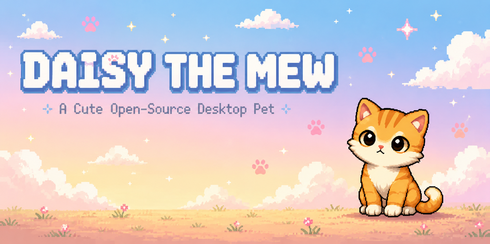

<p align="center">
  
</p>

## About

Bored of staring at code all day?

Meet  Daisy the Mew: a tiny cat that wanders around your desktop, takes cozy nap, follows your cursor with curious head tilts, and lets you pick her up for a quick cuddle.

She's not here to boost your productivity.

She's here to make your desktop a little more alive.


##  Features

- Walks around your desktop
    
- Sleeps when she's tired
        
- You can pick her up and drag her around
    
- Watches your mouse with curious head movements
    

## Quick Start

Clone the repository:

```bash
git clone https://github.com/TanvirTian/daisy-the-mew.git
cd daisy-the-mew
```

Install the dependencies:

```bash
go mod tidy
```

Run Daisy:

```bash
go run .

```
